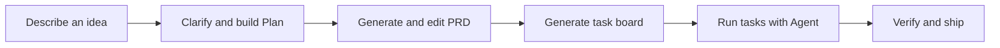

# Undagi

**Turn a rough idea into a buildable project.**

Undagi is a local-first AI workbench for moving from product intuition to an executable delivery plan:

```text
Idea → Plan → PRD → Agent-ready tasks → Implementation
```

Describe what you want to build, clarify the missing pieces, shape the architecture, and hand a coding agent a task board with concrete files, dependencies, prompts, and verification steps.

<p>
  <strong>Bring your own model.</strong> Connect a hosted provider, a local model, or any compatible endpoint.<br />
  <strong>Keep control.</strong> Sessions live in SQLite, workspaces are explicitly selected, and shell access is opt-in.<br />
  <strong>Stay in the flow.</strong> Plan, specify, export, and run tasks from one workbench.
</p>

## What you can do

| Capability | Outcome |
| --- | --- |
| Conversational intake | Start with an idea and let the Agent ask focused follow-up questions. |
| Project planning | Generate an editable summary, audience, value proposition, features, tech stack, architecture, Mermaid diagrams, roadmap, and estimate. |
| PRD generation | Turn the plan into an MVP-first PRD: goals and success metrics, target users, scope with non-goals, requirements with acceptance criteria, risks, then the technical design (architecture, data model, tech stack), with a Markdown view. |
| Task planning | Break the PRD into atomic coding tasks with target files, dependencies, instructions, and verification steps. |
| Task execution | Run one card, or a whole phase with **Run Phase**, in dependency order. Each card runs in a session of its own. The card moves to In progress when the run starts, to Done when it finishes (marked Verified when its verify command passed, Unverified when nothing checked it), to Blocked when the agent reports it needs something from you, and to Failed when the run or its check fails. |
| One project per folder | A folder holds one project (plan, PRD, board and memory) that every chat in it shares, so tomorrow's chat carries on where today's stopped. |
| Export | Tick the documents you want (plan, PRD, `AGENTS.md`, handoff bundle): one downloads as a file, several as one `.zip`. |
| Usage at a glance | The sidebar shows how much of each connected subscription is left: Claude Code, Codex and Antigravity. |
| Model routing | Use Codex, Claude Code, Antigravity, or an API connection; autodetect available models and native effort levels. |
| MCP tools | Add external tools through stdio or Streamable HTTP without changing application code. |

## The workflow



### 1. Plan

Use the Agent for a conversation-first intake, or fill the form manually. The planning step produces:

- project summary, target audience, and value proposition;
- core features and suggested tech stack;
- architecture and data-flow views, including Mermaid diagrams;
- phased roadmap, effort estimate, resources, and risks.

The generated feature list is editable. If the feature scope changes, the plan can be synchronized again before moving on.

### 2. PRD

Generate a requirements document from the approved plan, written the way product teams write one and sized to a first release: overview, goals and success metrics, target users, scope and release plan with non-goals, requirements as user stories with acceptance criteria, user flow, and assumptions, risks and open questions. A technical part follows for the coding agent: architecture, data model, and tech stack. Review it in the structured view, edit the source fields, or inspect the generated Markdown.

### 3. Send to Agent

Generate a ready-to-run task board. Each task includes a stable ID, priority, target files, dependencies, instructions, and verification steps. Use Kanban or detailed list view, drag tasks between states, run an individual task or a whole phase, copy prompts, or export `AGENTS.md` for another coding agent from **Export**.

When the PRD changes, tasks generated from the older version are marked as needing sync. **Sync** asks the model for a fresh breakdown and shows how many cards it replaces first. Cards you added yourself and cards already worked on (anything past To do, with their notes and Verified label) stay as they are, and the model is told about them so it does not build the same work again. Only cards still in To do are replaced.

#### Running the board

**Run Phase 1** (the button names the phase it will run) runs that phase's To do cards one at a time, in board order, each once its dependencies are Done. Every card goes through the same run as its own **Run** button: its own session, retries, verify command, and the card moved at the end. The run stops at the first card that does not end Done, so nothing builds on a failure, and **Stop** ends it. A line under the button says why it ended. A failed or blocked card keeps its phase open, so the next run never skips ahead of it, and you check one phase before the next starts.

Every chat turn carries the project's cards with their status and dependencies. Ask the chat to work on the tasks and it starts the same run instead of doing the cards in the conversation.

#### One project per folder

A folder has one project and any number of chats. The sidebar shows the folder's Plan, PRD and Kanban once, then its chats; **+** on the folder starts a new chat there. A new chat reads the same board, PRD and memory, so it can carry on with the phase left unfinished. Deleting a chat removes only its messages; deleting the project is a separate, confirmed action on the folder, and the files in the folder stay. Choosing a folder that already has a project joins it, and a chat that has a plan or tasks of its own asks first and keeps them if you decline.

#### Running a task

- **One session per card.** Each task run starts an agent session of its own, and its retries stay in it. The normal chat keeps a single conversation.
- **Project memory.** Every new task session starts with a `<project_memory>` block: the Done tasks with their notes, plus facts agents left on `MEMORY:` lines in their task report. It is handed over as context, not as instructions. Open **Project memory** on the board to see what the agents are told and to delete a fact that is wrong. The newest 50 facts are kept.
- **Verify command.** The generator writes a runnable `verifyCommand` for each task, and you can edit it on the card. After the agent says a task is done, Undagi runs the command in the project's working folder (5-minute limit). Exit code 0 moves the card to Done, marked **Verified**. Any other result sends the output back to the same session and the agent tries again, up to 2 times, before the card is Failed.
- **Approval.** Undagi asks before it runs the command, unless the chat is on Full access. This is separate from **Allow shell commands**: that switch limits the agent's own `run_command`, not a verify command you can read on the card. If you decline, or the task has no command, the card ends Done but **Unverified**: the agent's word stood and nothing checked it.
- **Windows.** The command runs in Windows PowerShell 5.1, which has no `&&`. Chain commands with `;`.

## Usage remaining

The bottom of the sidebar shows what is left of each subscription you have connected, one bar per window: Claude Code's five-hour and weekly windows, Codex's limits, and Antigravity's weekly limit per model group (Gemini, Claude and GPT). Each is read through that CLI's own usage request, which sends no prompt and spends no quota. A runtime that is not connected shows nothing.

- The panel reads again every 3 minutes, or 30 seconds while a row failed. **↻** reads at once.
- A read that fails keeps showing the last good one for up to 15 minutes, dimmed and marked as not refreshed in its tooltip.
- Three rows are visible; more scroll. The slider button hides rows and changes their order, and the choice is kept.
- A runtime with no official way to read its usage has no row. Antigravity needs version 1.1.11 or newer.

## Connect a model

Open **Connections** in the header and add a provider preset or a custom connection. The connection editor supports:

- `Anthropic Messages` and `OpenAI compatible` wire formats;
- base URL, model list, optional API key, and custom headers;
- enabled/disabled and JSON-mode settings;
- role bindings for `Agent`, `Plan`, `PRD`, and `Tasks`.

Included presets cover local routers, Ollama, LM Studio, OpenRouter, Anthropic, Gemini (OpenAI-compatible), and custom endpoints. No provider or model is bundled with the app.

### API keys

Keys saved through the UI are stored server-side in `data/undagi.db`; protect that file and its backups. After upgrading from a build that used `architech.db`, that old file stays on disk with the same keys in plaintext; delete it once you have checked the upgrade. To keep a key out of the database, put the variable name in **API key environment variable** and define the value in `.env`.

For the agent runtimes — Codex, Claude Code, and Antigravity — see [docs/harness/connections.md](docs/harness/connections.md): what each one needs installed, and how to read a runtime card that fails. Backups, the automatic migration, and how to go back a version are in [docs/harness/rollback.md](docs/harness/rollback.md).

```bash
cp .env.example .env
```

The example file includes:

| Variable | Typical use |
| --- | --- |
| `OPENAI_API_KEY` | OpenAI-compatible endpoints |
| `OPENROUTER_API_KEY` | OpenRouter |
| `ANTHROPIC_API_KEY` | Anthropic-format endpoints |
| `GEMINI_API_KEY` | Gemini compatibility or legacy fallback |
| `ANTHROPIC_AUTH_TOKEN` | Legacy compatibility only |

The app does not automatically choose one provider or one API-key variable. Select the variable explicitly on each connection.

## Give the Agent a workspace

The Agent can work with project files only after **Working folder** is set. Paths are resolved inside that folder, with symlink checks.

- File tools: `list_files`, `read_file`, `read_files`, `glob`, `grep`, `write_file`, and `edit_file`.
- Shell tool: `run_command`, available only after **Allow shell commands** is enabled.
- File writes and shell commands require approval.
- Shell access is disabled when no workspace is selected, and is off by default.

If you enable shell access, the model can run commands in the selected folder. Review approvals carefully, especially for destructive commands or commands that access the network.

## Add MCP servers

Open **Connections → MCP** to register external tools. The built-in client currently supports the MCP tool subset needed by the Agent:

| Transport | Configure with | Behavior |
| --- | --- | --- |
| `stdio` | command, one argument per line, environment JSON | Spawns the server on demand and speaks newline-delimited JSON-RPC. |
| Streamable HTTP | server URL and headers JSON | Uses JSON responses or Server-Sent Events and keeps the MCP session ID. |

MCP tools are discovered lazily, namespaced as `mcp__<server>__<tool>`, and isolated from built-in tools. A slow or unavailable server does not prevent the Agent turn from continuing; the UI receives an MCP status notice instead.

The current scope is `initialize`, `tools/list`, and `tools/call`. MCP `sampling`, `roots`, `elicitation`, `prompts`, and `resources` are intentionally outside the current UI and client scope.

## Quick start

### Requirements

- Codex, Claude Code, Antigravity, or a reachable model endpoint. The app does not ship with an AI model.
- Node.js **22.14+** only if you run from source. The desktop app bundles its own runtime.

### Desktop app

Download an installer from the [v1.0.5 release](https://github.com/CharisChakim/undagi/releases/tag/v1.0.5):

| Platform | File | Notes |
| --- | --- | --- |
| Windows | `Undagi-Setup-<version>-x64.exe` | Installs per user; you can pick the directory. |
| Linux | `Undagi-<version>-x86_64.AppImage` | Portable. `chmod +x` it, then run it. |
| Linux (Debian/Ubuntu) | `Undagi-<version>-amd64.deb` | `sudo apt install ./<file>.deb` |

The desktop build runs the same local server, picks a free port instead of
3000, and listens on `127.0.0.1` only. It keeps its data outside the install
directory:

| Platform | Data and `.env` location |
| --- | --- |
| Windows | `%APPDATA%\Undagi` |
| Linux | `~/.config/Undagi` |

The database is at `data/undagi.db` inside that folder. To supply API keys
through environment variables rather than the UI, put a `.env` file there.
If `undagi.db` is missing but an `architech.db` from an older build is in the
same folder, Undagi copies it to `undagi.db` on startup and leaves the old file
untouched.

On first launch, if that folder is empty and a folder from The Architech
(`%APPDATA%\The Architech` or `~/.config/The Architech`) exists, Undagi copies
it over, so projects and settings carry across. The old folder is left in place;
delete it once you have checked your projects.

No agent CLI is bundled. Codex, Claude Code, and Antigravity are detected on
your machine and driven from there, so the version the app reports is the one
it actually runs. **Connections → Runtimes** shows what was found and, for
anything missing, the command to install it.

The installers are unsigned, so Windows SmartScreen will warn on first run
("More info" → "Run anyway") and some Linux desktops will ask you to confirm
the AppImage is executable.

macOS is not supported yet: a packaged app would need Apple notarization, and
nothing has been tested on a Mac.

### Run from source

**Linux**

```bash
curl -fsSLO https://raw.githubusercontent.com/CharisChakim/undagi/main/install.sh
bash install.sh
undagi
```

**Windows PowerShell**

```powershell
Invoke-WebRequest https://raw.githubusercontent.com/CharisChakim/undagi/main/install.ps1 -OutFile install.ps1
powershell -ExecutionPolicy Bypass -File .\install.ps1
```

Then run `%LOCALAPPDATA%\Undagi\start-undagi.cmd`.

If an install from before the rename exists (`%LOCALAPPDATA%\TheArchitech` or
`~/.local/share/the-architech`), the installer moves it to the new location
first, so its `data/` and `.env` come along. The old `the-architech` launcher is
removed.

For development from an existing checkout:

```bash
npm install
npm run dev
```

Open [http://localhost:3000](http://localhost:3000), configure a model connection, and start a project. Sessions are created automatically once a project has a title.

The server listens on `127.0.0.1` only. `HOST=0.0.0.0` makes it reachable from the network. Do that only on a network you trust: the API has no login, and it can start processes and run commands on this machine.

### Production build

```bash
npm run build
npm start
```

The development command runs the Vite client and API server together. The production command runs the bundled server from `dist/`.

## Useful commands

| Command | Purpose |
| --- | --- |
| `npm run dev` | Start the Vite client and API server on port 3000 with server watching. |
| `npm run build` | Build the client and bundle the server into `dist/server.cjs`. |
| `npm start` | Run the production server. |
| `npm run lint` | Type-check the project with `tsc --noEmit`. |
| `npm run clean` | Remove generated build output. |

## Data and security notes

- Project sessions, saved connections, role bindings, and MCP server definitions are stored in `data/undagi.db`.
- So are your preferences (language, theme, layout, the open project, the runtime picked per chat). The desktop app opens on a new port each time and the browser's `localStorage` belongs to one port, so it would otherwise forget them on every launch. Unsent message drafts and a legacy model config that can hold an API key stay in the browser.
- `data/` is runtime state and should not be committed.
- API keys returned by the connections API are represented only by `hasKey`; the secret value is not sent back to the browser.
- Choose a workspace deliberately. The Agent has no file access until you provide one.
- Treat shell approval as code execution authority, not as a convenience toggle.

## Feedback and support

The bug icon in the header opens a dialog for a title and a description, then a prefilled issue on this repository's [GitHub Issues](https://github.com/CharisChakim/undagi/issues). You review it there and submit it with your own account; Undagi sends nothing itself. The issue carries the app version.

Undagi is free and open source. If it helps your work, the coffee icon in the header opens a QRIS code (Indonesia) and a [PayPal.Me](https://paypal.me/undagicc) link.

## Built with

React 19 · TypeScript · Vite · Express · Node `node:sqlite` · Tailwind CSS · Mermaid · Lucide

## Project layout

```text
src/                    React UI, workflow steps, state, exports, and i18n
server/                 API routes, LLM adapters, agent loop, runtime usage, preferences, and MCP client
db.ts                   SQLite bootstrap and session persistence
docs/harness/            Phase-by-phase implementation notes
data/                   Local runtime database (created on first run)
```

The UI is available in English and Bahasa Indonesia, with light and dark themes.
